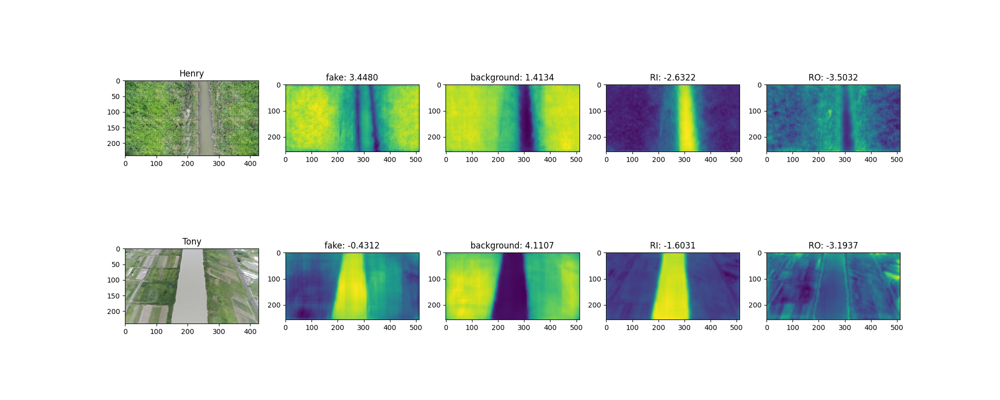

# Ensemble

由於 DP-GAN 與 PITI 為兩種不同架構的生成式網路，在生成任務上可能會各有好壞，因此我們決定結合兩模型的生成圖。考慮到在 DP-GAN 中的 D 網路能夠判斷輸入影像的每個 pixel 的 fake 分數與背景、RI類別、RO類別的機率，我們分別將兩模型生成的每張圖傳入 D 網路，計算每張圖的 fake、背景、RI 與 RO 輸出平均值，如圖_。其中上、下排影像即分別表示在同樣 label 下 DP-GAN 與 PITI 生成影像經 D 網路推論後輸出之特徵圖與平均值。

因 PITI 模型在 Public 資料集的表現較佳，集成時預設採用 PITI 所生成的影像，然後針對逐個生成影像進行判斷，當 DP-GAN 同時滿足 (1) fake 分數較低；(2) RI/RO 分數較高時，改使用 DP-GAN 生成的影像。

基於以上規則，最終採用了 192 筆 DP-GAN 生成影像，1248 筆 PITI 生成影像。
