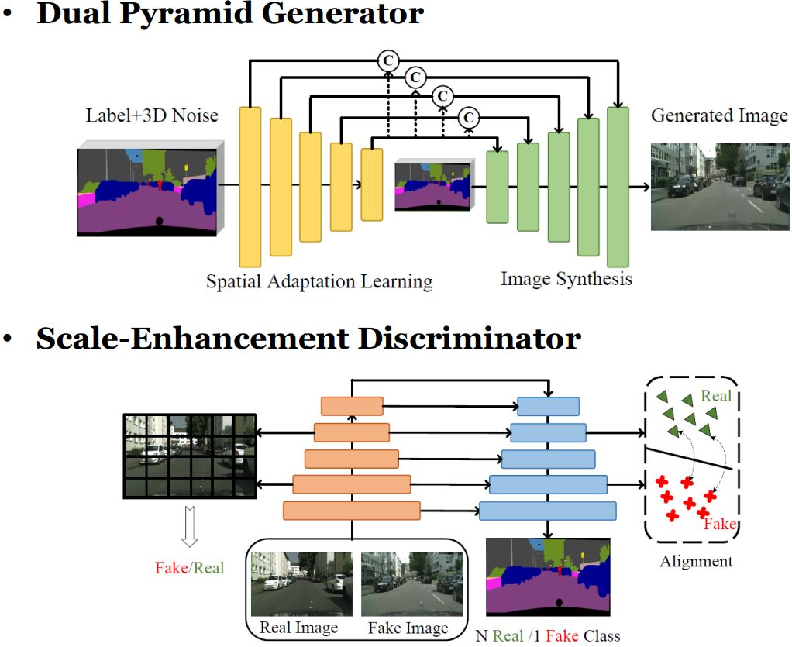
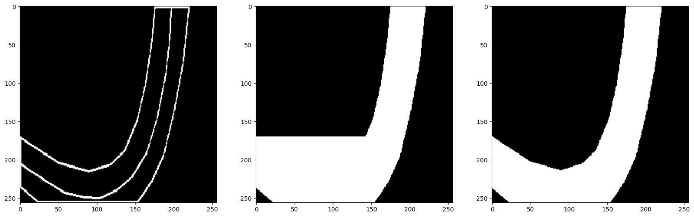
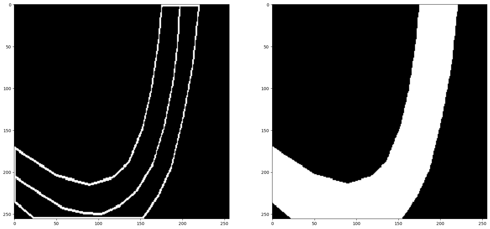
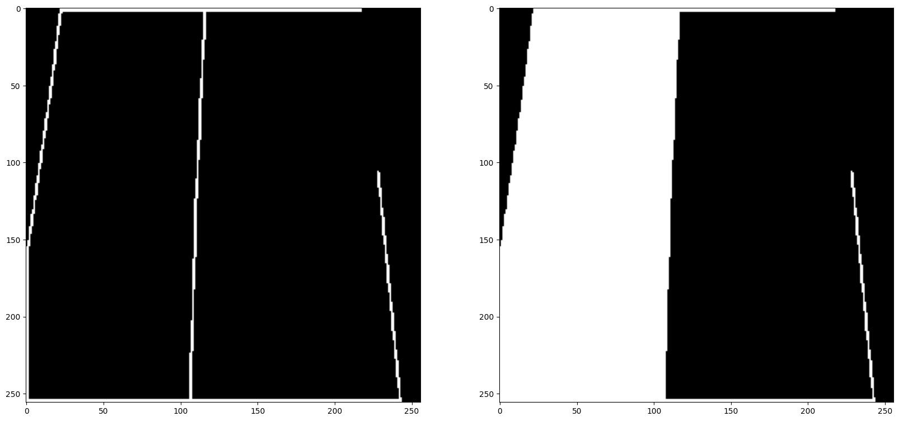
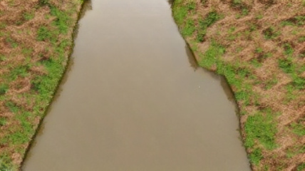
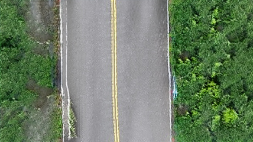
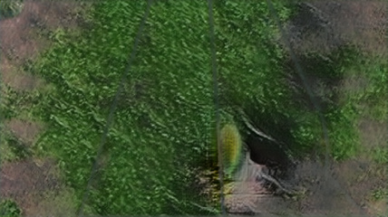
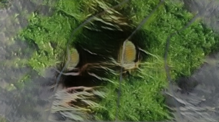

# AI CUP 2024 春季賽
## 環境

在基於 [tensorflow:2.15.0-gpu](https://hub.docker.com/layers/tensorflow/tensorflow/2.15.0-gpu/images/sha256-66b44c162783bb92ab6f44c1b38bcdfef70af20937089deb7bc20a4f3d7e5491?context=explore) 的 container 進行開發與訓練，此外還需要安裝 torch、pandas、opencv-python 與 wandb 套件。無使用任何預訓練模型。

## 演算法與模型架構

### Dual-Pyramid Generator
生成式網路由兩個 Pyramid 網路組成，一個用於影像生成，另一個導入了 Spatially-Adaptive Norm 學習輸入的 Label，可以生成更多樣的圖像。輸入資料尺寸為 [B, 3, 256, 512]，其中三個 channel 分別表示背景、RI 類別與 RO 類別。

### Scale-Enhancement Discriminator
鑑別器網路採 encoder-decoder 架構設計，會判斷輸入影像逐個 pixel 屬於某類別的機率。輸出尺寸為 [B, 4, 256, 512]，其中第一個 channel 表示為 fake 的機率，後三個 channel 則分別代表為背景、RI 類別與 RO 類別的機率。

## 技術模型原創性或改良成效

見 [ensemble](./ensemble.md)

<!-- 考量到 FID 的計算方式是基於 InceptionV3，因此在生成式網路的 Loss function 中加入 InceptionV3 Loss。會使用 InceptionV3 分別提取生成圖像與真實圖像的特徵，並計算兩特徵的 MAE，乘上權重後與原本的 Loss 相加。 -->

## 資料分析與處理過程

官方提供的訓練資料被切分為八成的訓練資料與兩成的測試資料，而八成的訓練資料會再切分其中的一成當作驗證資料，用於挑選模型。

由於模型輸入與影像分割相同，須對每個 pixel 標上正確類別，因此須將給定的 Label 資料集轉換成 Segmentation，也就是填滿給定的線條範圍。曾經嘗試過 row-wise 或 column-wise 的填滿最外 pixel 以內的範圍，如下圖，但在有 U 型線條的 Label 圖看起來會不合理。

為了解決此問題，找到了 OpenCV 內建的 findContours 函數用於尋找輪廓，並可針對找到的輪廓進行填色，符合模型需求，因此後續模型前處理皆會使用此函數進行處理，如下圖。

仍有少數資料集無法如預期般填色，如下圖。線條中若有缺口則無法在輪廓中填色，但因時間關係尚無法做處理。

## 訓練方式

在訓練階段，模型的輸入資料會經過以下處理：Resize 到較大尺寸 [3, 310, 620]、RandomCrop 成 [3, 256, 512] 尺寸、隨機左右翻轉與上下翻轉、影像正規化，值域落在-1~1之間；生成階段則不會 Resize 到較大尺寸與隨機翻轉。
基於模型的預設超參數，還調整了以下設定：模型正規化方式採用 InstanceNorm2d；生成式網路的 latent vector 維度調整為 128、epochs 設為 400。

## 結果分析與結論

訓練階段會持續計算驗證資料集的 FID 分數，以便觀察模型訓練狀況，如下圖，最終 FID 值為 96.94。可以看到訓練到 50K step 以後 FID 就已逐漸收斂，但仍有緩慢在往下探，未來或許可以再提高 epochs。

生成的圖像大多如下圖a、b，可以稍微看出有些紋路的重複性很高，還沒有辦法生出較多樣化的景觀；而在線條中有缺口的樣本中，生成結果會如下圖c、d，更是能看出線條內沒有生成出正確影像，未來還需想辦法解決此類 label 帶有缺口的資料。

<table>
<tr>
<td align='center'>a</td>
<td align='center'>b</td>
</tr>
<tr>
<td align='center'>c</td>
<td align='center'>d</td>
</tr>
</table>

## 程式碼

[DP-GAN](https://github.com/Tsao666/DP_GAN)

## 使用的外部資源與參考文獻

Li, S., Cheng, M. M., & Gall, J. (2022). Dual pyramid generative adversarial networks for semantic image synthesis. *arXiv preprint arXiv:2210.04085.*
